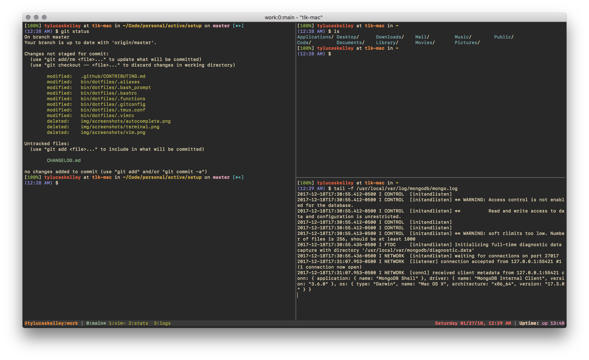
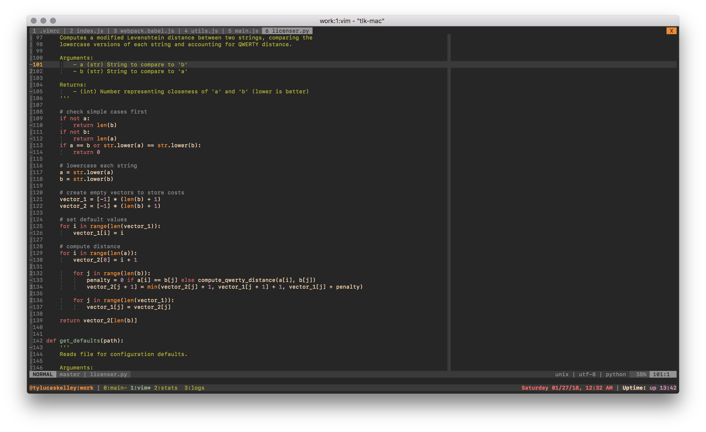
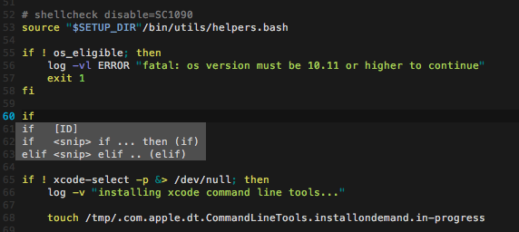

# Setup

> My automated development setup for Mac

---


## Prerequisites

- Apple computer running macOS High Sierra (10.13)

This will also run on macOS 10.11 and 10.12, but is no longer guaranteed to work on those operating systems. Run at
your own risk or upgrade!

## Installation

Be sure to read [setup.bash](bin/setup.bash) before running it! It's broken up into sections and commented, so it's
not too tough to scan through quickly. Once you've done that, copy and paste this line into your terminal:

```sh
curl https://raw.githubusercontent.com/tylucaskelley/setup.sh/master/bin/setup.bash -o setup.bash && caffeinate -i bash setup.bash
```

Note that you will be prompted for input several times as the script runs. When done, restart your terminal to see
all changes.

## ~/.env

Use the provided `~/.env` file for any sensitive information, such as passwords,
API keys, etc. This file can also be used to override anything I've written.

## Features

Here's an overview of everything the setup scripts do:

1. Installs the Xcode command line tools and [Homebrew](bin/scripts/brew.bash)
   to manage packages
2. Configures dev environments for the latest versions of some languages (optional):
    - [Go](bin/scripts/go.bash)
    - [Java](bin/scripts/java.bash)
    - [Node.js](bin/scripts/node.bash)
    - [Python 2 & 3](bin/scripts/python.bash)
    - [Ruby](bin/scripts/ruby.bash)
    - [Rust](bin/scripts/rust.bash)
3. Uses [Homebrew Cask](bin/scripts/brew-cask.bash) to install Mac applications (optional)
4. Copies my [dotfiles](bin/dotfiles) to the home directory and creates a `.env` file for sensitive info
5. Creates an SSH key and adds it to the macOS Keychain (optional)
6. Sets up the [Vim](bin/scripts/vim.bash) editor for development (optional)
7. Changes the `Terminal.app` [theme](bin/scripts/terminal.bash) (optional)

## Testing

To run the test suite (which is minimal at this time), simply make sure you've downloaded
[bats](https://github.com/sstephenson/bats) and then run:

```bash
$ bats test
```

The testing tool can be downloaded via Homebrew if you're on a Mac:

```bash
$ brew install bats
```

## Contributing

See [CONTRIBUTING.md](.github/CONTRIBUTING.md) if you'd like to add to the project, and file an issue if something
goes wrong when you try to run the script.

## Screenshots

Here's a gallery of a few screenshots:






